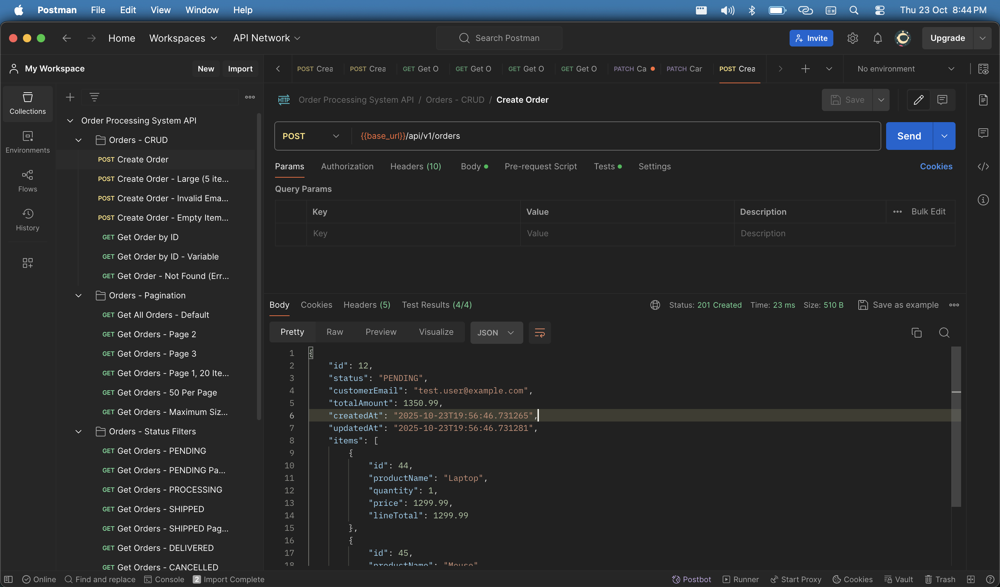
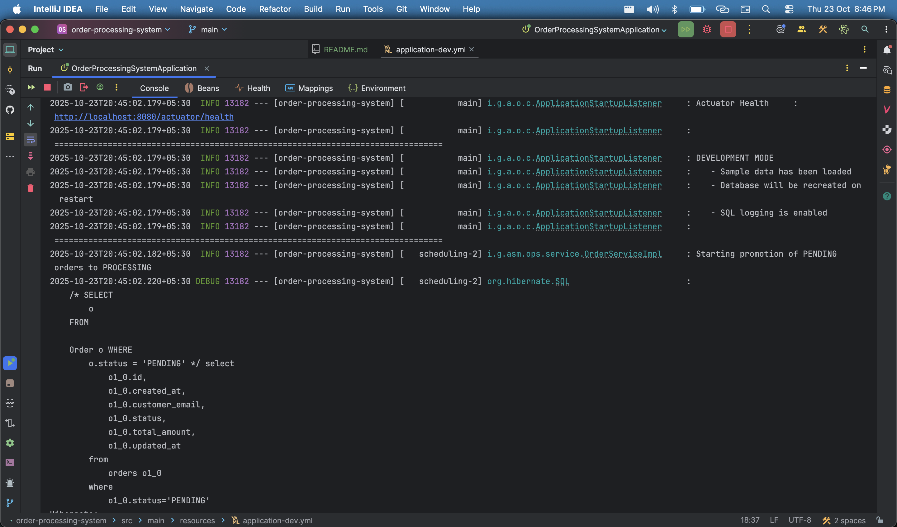
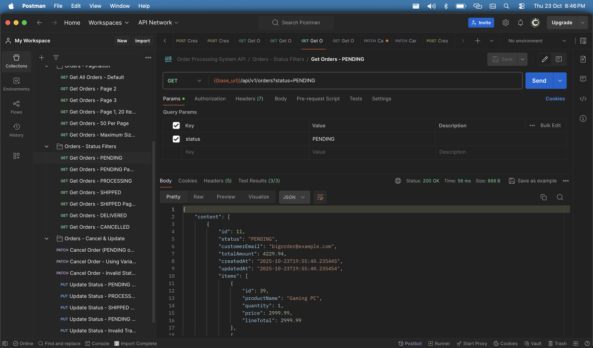
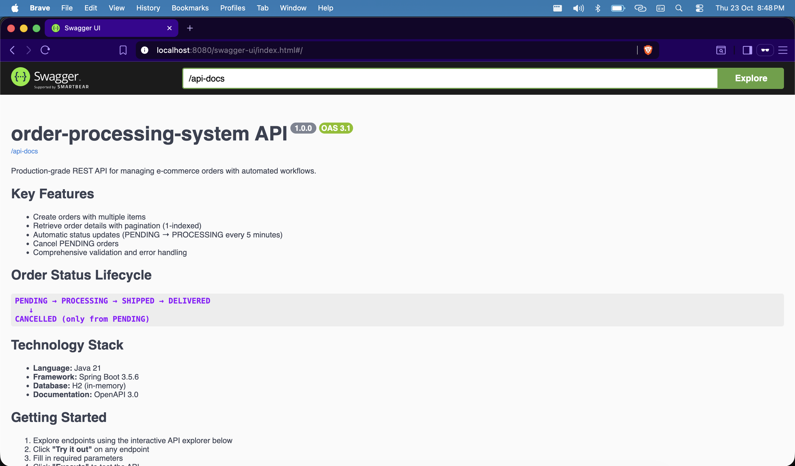
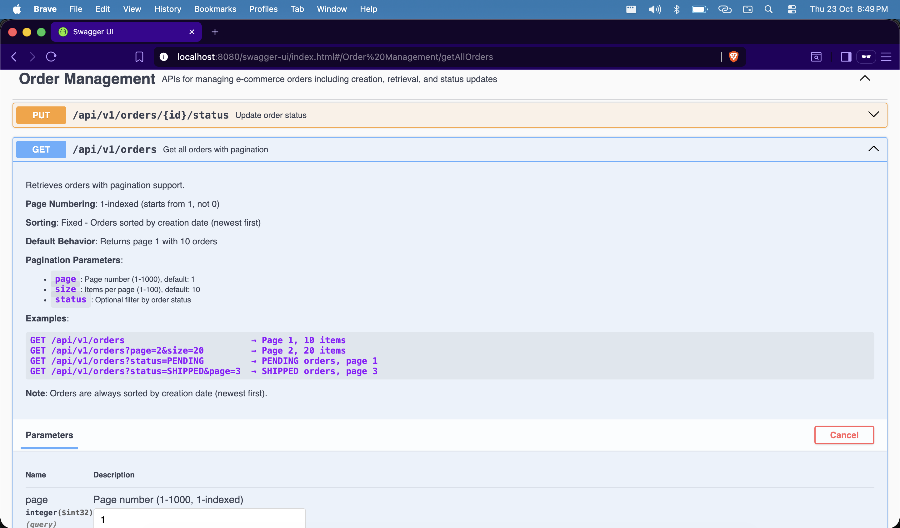

# E-Commerce Order Processing System

A modern REST API for managing e-commerce orders, built with Java 21 and Spring Boot 3.5.6.

***

## Introduction

This project is a production-grade REST API for handling e-commerce order workflows. It supports order creation, listing with pagination, status management, cancellation, and periodic background processing of pending orders. The API is designed with clean architecture principles and is suitable for learning, interviews, or as a starting point for larger systems.

***

## Tech Stack

- **Java 21**
- **Spring Boot 3.5.6**
- **Spring Data JPA** (Hibernate)
- **H2 Database** (in-memory for development)
- **OpenAPI 3 / Swagger UI** (interactive API documentation)
- **MapStruct** (DTO mapping)
- **Maven** (build tool)

***

## Folder Structure

```
order-processing-system/
├── src/
│   ├── main/
│   │   ├── java/io/ganeshannt/asm/ops/
│   │   │   ├── config/          # Configuration (scheduling, OpenAPI, etc.)
│   │   │   ├── controller/      # REST controllers
│   │   │   ├── dto/             # Data Transfer Objects
│   │   │   ├── entity/          # JPA entities (Order, OrderItem)
│   │   │   ├── enums/           # Enumerations (OrderStatus)
│   │   │   ├── exception/       # Exception handling
│   │   │   ├── mapper/          # MapStruct DTO/entity mappers
│   │   │   ├── repository/      # Spring Data JPA repositories
│   │   │   ├── scheduler/       # Background jobs
│   │   │   └── service/         # Business logic layer
│   │   └── resources/
│   │       └── application.yml  # Configuration for all profiles
│   └── test/
│       ├── java/io/ganeshannt/asm/ops/
│       │   ├── config/          # Test data initializer
│       │   └── controller/      # Integration tests (WebTestClient)
│       └── resources/
│           └── application-test.yml  # Test profile configuration
├── postman/
│   └── Order-Processing-API.postman_collection.json
├── pom.xml
└── README.md
```

***

## High-Level Overview

### Core Features

- **Order CRUD**: Create, retrieve by ID, list with pagination (1-indexed, default 10 per page), filter by status
- **Status Lifecycle**: `PENDING → PROCESSING → SHIPPED → DELIVERED` (or `CANCELLED` from `PENDING`)
- **Scheduled Processing**: Background job runs every 5 minutes to promote all `PENDING` orders to `PROCESSING`
- **Order Cancellation**: PATCH endpoint to cancel `PENDING` orders only
- **Pagination**: 1-indexed pagination (page 1-1000, size 1-100)

### Technical Features

- Virtual threads for lightweight concurrency
- H2 in-memory database (dev profile) with console access
- Clean JSON responses (non-null fields only, ISO-8601 dates)
- Comprehensive validation and error handling
- OpenAPI 3.0 documentation with Swagger UI
- Integration tests with dedicated test profile

***

## Quick Start

### Prerequisites

- **Java 21+** ([Download](https://adoptium.net/))
- **Maven 3.8+** ([Download](https://maven.apache.org/download.cgi))
- (Optional) **IntelliJ IDEA** or any Java IDE
- (Optional) **Postman** for API testing

### Installation & Running

#### 1. Clone the Repository

```bash
git clone https://github.com/yourusername/order-processing-system.git
cd order-processing-system
```

#### 2. Build the Project

```bash
mvn clean install
```

#### 3. Run the Application

**Option A: Using Maven (recommended for development)**

```bash
# Run with dev profile (default)
mvn spring-boot:run

# Run with prod profile
mvn spring-boot:run -Dspring-boot.run.arguments=--spring.profiles.active=prod
```

**Option B: Using JAR**

```bash
# Build JAR
mvn clean package

# Run with dev profile
java -jar target/order-processing-system-1.0.0.jar

# Run with prod profile
java -jar target/order-processing-system-1.0.0.jar --spring.profiles.active=prod
```

> **Note**: Development profile (`dev`) is used by default and includes 10 sample orders.

#### 4. Access the Application

| Resource | URL | Description |
|----------|-----|-------------|
| **Swagger UI** | [http://localhost:8080/swagger-ui.html](http://localhost:8080/swagger-ui.html) | Interactive API documentation |
| **OpenAPI Spec** | [http://localhost:8080/api-docs](http://localhost:8080/api-docs) | OpenAPI 3.0 JSON specification |
| **H2 Console** | [http://localhost:8080/h2-console](http://localhost:8080/h2-console) | Database console (dev only) |
| **Health Check** | [http://localhost:8080/actuator/health](http://localhost:8080/actuator/health) | Application health status |

**H2 Console Credentials:**
- JDBC URL: `jdbc:h2:mem:orderdb_dev`
- Username: `sa`
- Password: `dev123`

#### 5. Test the API

**Option A: Swagger UI**
1. Open [http://localhost:8080/swagger-ui.html](http://localhost:8080/swagger-ui.html)
2. Click on any endpoint
3. Click "Try it out"
4. Fill in parameters
5. Click "Execute"

**Option B: Postman Collection**
1. Import `postman/Order-Processing-API.postman_collection.json` into Postman
2. Collection includes 30+ pre-configured requests
3. Run requests individually or use Collection Runner

**Option C: cURL**

```bash
# Create an order
curl -X POST http://localhost:8080/api/v1/orders \
  -H "Content-Type: application/json" \
  -d '{
    "customerEmail": "test@example.com",
    "items": [{
      "productName": "Laptop",
      "quantity": 1,
      "price": 1299.99
    }]
  }'

# Get all orders (page 1, 10 items)
curl http://localhost:8080/api/v1/orders

# Filter by status
curl http://localhost:8080/api/v1/orders?status=PENDING
```

#### 6. Run Tests

```bash
# Run all tests
mvn test

# Run with coverage
mvn clean test jacoco:report

# Run specific test class
mvn test -Dtest=OrderControllerWebTestClientTest
```

> **Note**: Tests automatically use the `test` profile with minimal sample data (5 orders).

***

## Profiles

| Profile | Purpose | Database | Sample Data | Scheduler | H2 Console |
|---------|---------|----------|-------------|-----------|------------|
| **dev** | Local development | In-memory | 10 orders | ✅ Enabled | ✅ Enabled |
| **prod** | Production | File-based | None | ✅ Enabled | ❌ Disabled |
| **test** | Testing | In-memory | 5 orders | ❌ Disabled | ✅ Enabled |

---

## API Examples with Screenshots

### 1. Create Order

**Request:**
```bash
POST /api/v1/orders
```

:**








```bash
GET /api/v1/orders?status=PENDING&page=1&size=10
```


***